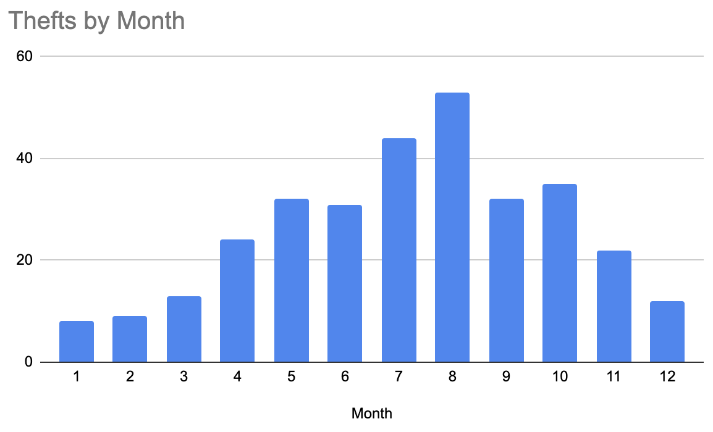

This folder contains code and analysis of bike thefts around Madison, WI. The methodology involves:
1. copy the HTML listing of [bike thefts listed on BikeIndex.org within 10 miles of Madison, WI](https://bikeindex.org/bikes?distance=10&location=Madison%2C+WI%2C+US&stolenness=proximity) into 
`urls.html`
2. scrape the details of each bke theft using `scrape.py` into `stolen_bikes.tsv` with `python scrape.py > stolen_bikes.tsv`
3. deduplicate, clean up, and aggregate results using [earthmover](https://github.com/edanalytics/earthmover) and produce several files in `output/`
4. (manual step) graph results to produce images in `graphs/` folder, including the map based on [this codepen](https://codepen.io/matthieuSolente/pen/VwvBVNj)

The data is current as of July 16, 2023. Some interesting results include:

* 
  Thefts are steadily rising every year since 2019

* 
  Thefts are more common in the summer months - especially August, right before classes start at UW

* 
  Thefts are more common near Willie Street and South Park Street

* 
  Trek is by far the most commonly-stolen bike brand
